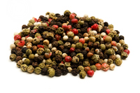

# peppercorn

- Word: peppercorn

- Type: noun [C]
- Meaning: a small, dried fruit that looks like a seed and is crushed to produce pepper; a dried berry from a tropical plant, that is crushed to make pepper
- Chinese: 胡椒粒；干胡椒籽
- Tags: 
- Eg.: 
- Picture: 

