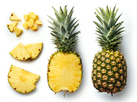

# pineapple

- Word: pineapple

- Type: noun [C or U]
- Meaning: a large tropical fruit with thick rough skin, sweet yellow flesh with a lot of juice and stiff leaves on top
- Chinese: 菠萝；凤梨
- Tags: fruit::tropical
- Eg.: tinned pineapples 罐装的菠萝
- Eg.: pineapple juice 菠萝果汁
- Picture: 

