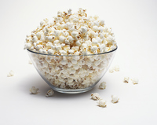

# popcorn

- Word: popcorn

- Type: noun [U]
- Meaning: seeds of maize that are heated until they break open and become soft and light, usually flavoured with salt, butter, or sugar
- Chinese: 爆（玉）米花
- Tags: 
- Eg.: a tub of popcorn
- Picture: 

