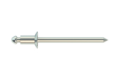

# rivet

- Word: rivet
- Story: A rivet is a metal fastener, a bolt-like device that holds together two pieces of metal or fabric. The round metal fasteners on your favorite pair of jeans are rivets.
- Story: Older buildings with metal frames like the Eiffel Tower(艾斐尔铁塔) are held together with rivets, and so are some bridges and military vehicles. Furniture upholstery(家具装饰品) often involves rivets, too. When you use a rivet to fasten, you can say you rivet — and similarly, to hold attention or captivate is also to rivet. The Old French root is river, "to clench or fasten."

- Type: noun [C]
- Meaning: a metal pin used to fasten flat pieces of metal or other thick materials such as leather
- Chinese: 铆钉
- Tags: 
- Eg.: 
- Picture: 

- Type: verb [T]
- Meaning: to fasten sth with rivets
- Chinese: 铆接；（用铆钉）固定
- Tags: 
- Use: ~ sth
- Eg.: Many parts of an aircraft are riveted together.

- Type: verb [T]
- Meaning: to hold sb's interest or attention so completely that they cannot look away or think of anything else
- Chinese: 吸引住
- Tags: attention
- Use: ~ sb/sth
- Eg.: be riveted = to not be able to stop looking at something because it is so interesting or frightening
- Eg.: It was an amazing film - I was absolutely riveted.
- Eg.: His eyes were riveted on the television.
- Eg.: He pulled out a gun and I was riveted to the spot (= so frightened that I could not move).

