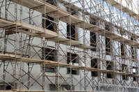

# scaffolding

- Word: scaffolding

- Type: noun [U]
- Meaning: poles and boards that are joined together to make a structure for workers to stand on when they are working high up on the outside wall of a building
- Chinese: 脚手架
- Tags: building
- Eg.: 
- Picture: 

