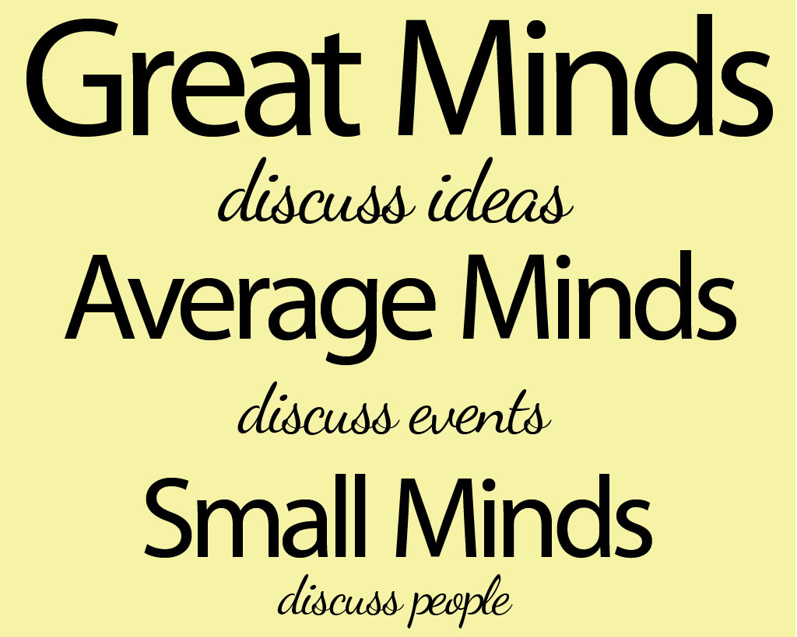

# small-minded

- Word: small-minded

- Type: adjective
- Meaning: having fixed opinions and ways of doing things and not willing to change them or consider other people's opinions or feelings; interested in small problems and details and not in things which are really important
- Chinese: 狭隘的；固执己见的；心胸狭窄的；目光短浅的
- Tags: 
- Eg.: 
- Picture: 

