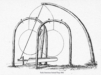

# snare

- Word: snare

## noun

- Meaning: a trick or situation that deceives you or involves you in some problem that you do not know about
- Chinese: 圈套；陷阱
- Tags: 
- Eg.: The legal system is full of snares for those who are not wary.
- Picture: 

