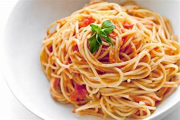

# spaghetti

- Word: spaghetti

- Type: noun [U]
- Meaning: pasta(意大利面食) in the shape of long thin pieces that look like string when they are cooked
- Chinese: 意大利细面条
- Tags: food
- Eg.: 
- Picture: 

