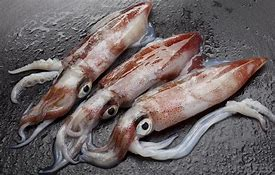

# squid

- Word: squid
- Cognate: 
- Story: A squid is a sea creature that's similar to an octopus but has ten arms instead of eight—including two extra tentacles(触手；触须) they use for grabbing their prey. The largest squid ever found was nearly 60 feet long!
- Story: Like their octopus relatives, squid are cephalopods(头足动物), or mollusks(软体动物) with prominent heads and many arms. Squid can swim extremely fast by sucking in water and propelling it out (just like jet propulsion), and their skin can change color so they blend in with their surroundings. Squid squirt a kind of dark ink to confuse predators; some language experts believe that squid was once sailors' slang(俗语；行话) for squirt.

- Type: noun [C]
- Plural: 
- Single: 
- Comparative: 
- Meaning: a sea creature that has a long soft body, eight arms and two tentacles (= long thin parts like arms) around its mouth, and that is sometimes used for food
- Chinese: 枪乌贼；鱿鱼
- Tags: 
- Synonyms: 
- Antonyms: 
- Similar: 
- Use: 
- Eg.: 
- Picture: 

