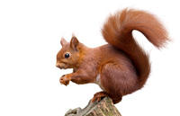

# squirrel

- Word: squirrel
- Cognate: squirrelly

- Type: noun [C]
- Meaning: a small animal covered in fur with a long tail. Squirrels climb trees and feed on nuts and seeds.
- Chinese: 松鼠
- Tags: creature::animal, habitat::forest
- Eg.: 
- Picture: 

