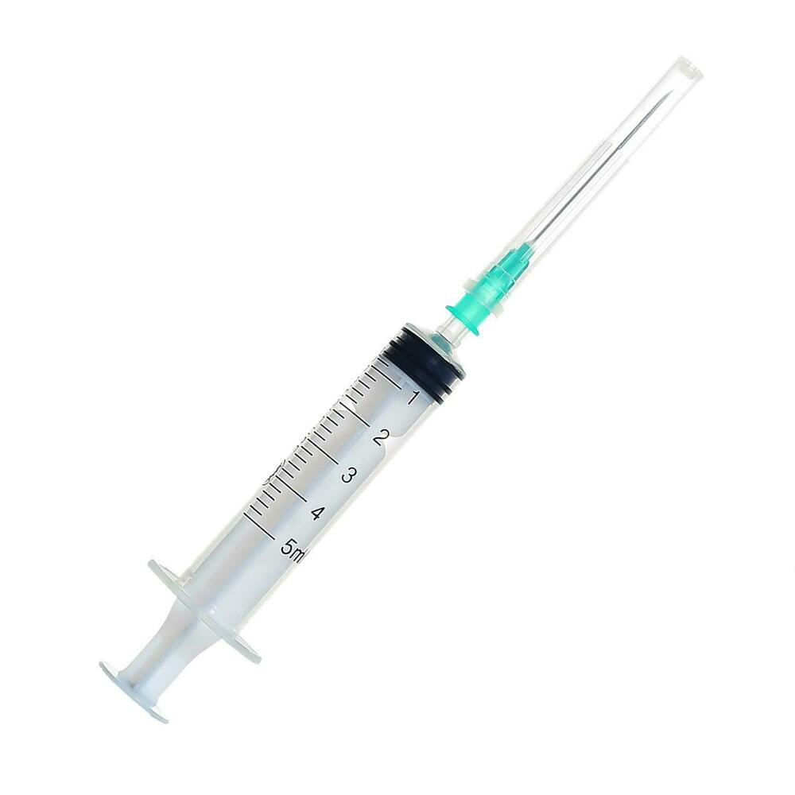

# syringe

- Word: syringe
- Story: A syringe is used, usually by a doctor or nurse, to inject or withdraw a fluid from your body.
- Story: A syringe is a medical tool used for several purposes, but they all involve liquids going in or out of your body. A flu shot is given with a syringe: that's a liquid going in. A blood sample is taken with a syringe: that's liquid coming out. Part of a syringe is a needle, so patients usually don't like them. Syringes should only be used by medical professionals.

## noun

- Meaning: a plastic or glass tube with a long hollow(中空的；空心的) needle that is used for putting drugs, etc. into a person's body or for taking a small amount of blood from a person
- Chinese: （皮下）注射器
- Tags: medical
- Picture: 

