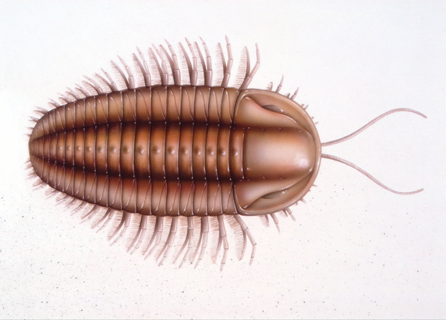

# trilobite

- Word: trilobite

- Type: noun [C]
- Meaning: a simple, flat sea creature that lived in the earliest period of life on earth, with a hard outer layer and a body in three parts; a small sea creature that lived millions of years ago and is now a fossil
- Chinese: 三叶虫（生活于几百万年前的小型海洋生物，已成化石）
- Tags: 
- Eg.: 
- Picture: 

