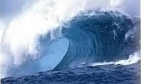

# tsunami

- Word: tsunami
- Cognate: 
- Story: A tsunami is an enormous sea wave that erupts and reaches land. You should be afraid of them, because a tsunami can destroy a coastal region in minutes.
- Story: Japan has had the misfortune of experiencing many tsunamis. They're caused by earthquakes or volcanic eruptions under the sea. In Japanese, tsu means "harbor" and nami means "wave." We sometimes use tsunami metaphorically, to describe really destructive events. After your parents came home, they compared the mess from your party to a tsunami.

- Type: noun [C]
- Plural: 
- Single: 
- Comparative: 
- Meaning: an extremely large wave in the sea caused, for example, by an earthquake
- Chinese: 海啸
- Tags: nature
- Synonyms: 
- Antonyms: 
- Similar: 
- Use: 
- Eg.: 
- Picture: 

