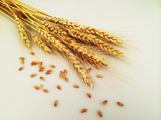

# wheat

- Word: wheat
- Story: Wheat is the grain most commonly used in things like bread, pasta, and cake. When wheat is ground, it becomes flour you can use for baking. Who wants cupcakes?
- Story: A field of wheat looks like tall, green grasses — the wheat turns golden-colored when it's ready to be harvested. More farmland is planted with wheat than any other crop, as it's a major worldwide source of carbohydrates. Some people are sensitive or allergic to the gluten in wheat, but most of us can safely eat and enjoy the many foods made from wheat. The Germanic source means "that which is white," from a root meaning "to shine."

## noun

- Meaning: a plant whose yellowish-brown grain is used for making flour, or the grain itself
- Chinese: 小麦
- Tags: food, crop
- Eg.: wheat fields
- Eg.: Wheat is a staple crop for millions of people across the world.
- Picture: 

